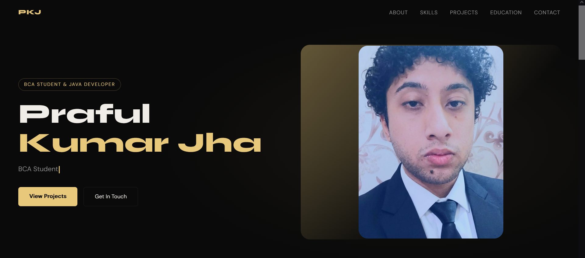
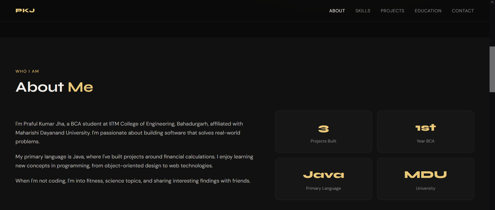
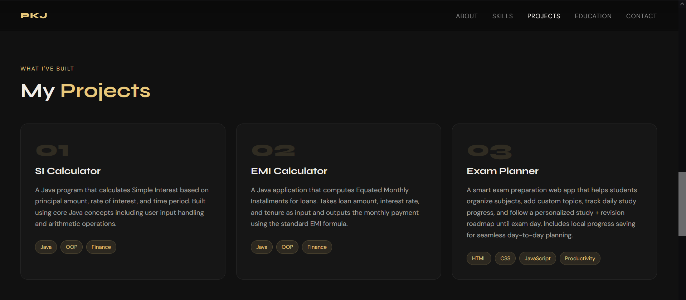

# 🌐 Personal Portfolio Website

Welcome to my personal portfolio website 👋  
This project showcases my skills, projects, and journey as a web developer.

---

## 🚀 Live Demo
👉 https://your-username.github.io/your-repo-name

---

## 🧑‍💻 About
A responsive personal portfolio website built using HTML, CSS, and JavaScript.  
It is designed to present my projects, skills, and learning progress in web development.

---

## 🛠️ Tech Stack
- HTML5  
- CSS3  
- JavaScript  

---

## ✨ Features
- Fully responsive design (mobile + desktop)  
- Clean and simple UI  
- About section  
- Projects showcase section  
- Contact section  
- Smooth scrolling navigation  

---

## 📁 Project Structure
/assets  
&nbsp;&nbsp;├── images  
&nbsp;&nbsp;&nbsp;&nbsp;├── home.png  
&nbsp;&nbsp;&nbsp;&nbsp;├── about.png  
&nbsp;&nbsp;&nbsp;&nbsp;├── projects.png  

index.html  
style.css  
script.js  

---

## 📸 Preview

### 🏠 Home Section

### 👤 About Section

### 💼 Projects Section

---

## 📚 What I Learned
- Structuring a real-world frontend project  
- Working with HTML, CSS, and JavaScript together  
- Responsive design techniques  
- DOM manipulation  
- Hosting using GitHub Pages  

---

## 🔗 Links
- GitHub: https://github.com/your-username  
- Live Site: https://your-username.github.io/your-repo-name  

---

## ⭐ Support
If you like this project, feel free to star it ⭐  
Feedback and suggestions are always welcome.

---

Built while learning, improving, and experimenting 🚀
